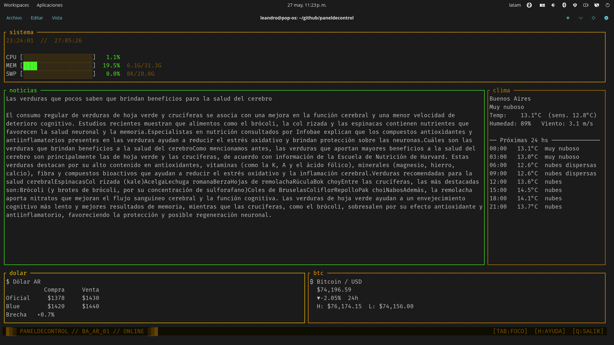

# paneldecontrol

Panel de control TUI para la terminal, inspirado en btop. Muestra widgets de sistema, clima, noticias, cotizaciones y reproductor multimedia — todo configurable desde un único `config.toml`.

## Captura



```
╭─ sistema ────────────────────────────────────────────────────────────────────╮
│CPU  [████████████░░░░░░░░]  58.3%                                            │
│MEM  [███████████░░░░░░░░░]   5.8G/16.0G                                      │
│/        [████░░░░░░░░░░░░░░░░]  45G/100G                                     │
╰──────────────────────────────────────────────────────────────────────────────╯
╭─ noticias ────────────────────────────────────────────╮╭─ clima ────────────╮
│  1. Título de la primera noticia                      ││Buenos Aires        │
│  2. Título de la segunda noticia                      ││Cielo despejado     │
│  3. ...                                               ││Temp:  22.5°C       │
╰───────────────────────────────────────────────────────╯╰────────────────────╯
╭─ dolar ──────────────────────────────╮╭─ btc ──────────────────────────────╮
│ $ Dólar AR                           ││ ₿ Bitcoin / USD                    │
│          Compra    Venta             ││   $74,196.59                       │
│ Oficial  $1036    $1075              ││   ▲+2.34%  24h                     │
╰──────────────────────────────────────╯╰────────────────────────────────────╯
╭─ musica ─────────────────────────────────────────────────────────────────────╮
│▶  Artista — Título de la canción                                             │
╰──────────────────────────────────────────────────────────────────────────────╯
```

## Requisitos

- Rust 1.75+
- Para el widget **clima**: cuenta gratuita en [openweathermap.org](https://openweathermap.org/api)
- Para **TTS**: [Piper](https://github.com/rhasspy/piper), `espeak-ng`, o `spd-say`
- Para el widget **player**: [`playerctl`](https://github.com/altdesktop/playerctl)

## Instalación

```bash
git clone https://github.com/tu-usuario/paneldecontrol
cd paneldecontrol
cargo build --release
./target/release/paneldecontrol
```

### Binario estático (sin dependencias)

```bash
rustup target add x86_64-unknown-linux-musl
sudo apt install musl-tools        # Debian/Ubuntu
cargo build --release --target x86_64-unknown-linux-musl
# binario en target/x86_64-unknown-linux-musl/release/paneldecontrol
```

## Configuración

La configuración se busca en este orden:
1. `./config.toml` (directorio actual)
2. `~/.config/paneldecontrol/config.toml`

```toml
[[layout.rows]]
height = 12
slots = [
    { width = 100, widget = "sistema" },
]

[[layout.rows]]
height = 61
slots = [
    { width = 70, widget = "noticias" },
    { width = 30, widget = "clima" },
]

[[layout.rows]]
height = 15
slots = [
    { width = 50, widget = "dolar" },
    { width = 50, widget = "btc" },
]

[[layout.rows]]
height = 12
slots = [
    { width = 100, widget = "musica" },
]

[widgets.sistema]
kind = "sistema"

[widgets.clima]
kind     = "weather"
location = "Buenos Aires,AR"
api_key  = "TU_API_KEY"
ttl_secs = 600

[widgets.noticias]
kind      = "rss"
url       = "https://feeds.bbci.co.uk/mundo/rss.xml"
max_items = 12
ttl_secs  = 300
tts_cmd   = "piper --model ~/.local/share/piper/voices/es_ES-davefx-medium.onnx --output-raw | aplay -r 22050 -f S16_LE -c 1 -t raw -q"

[widgets.dolar]
kind     = "dolar"
ttl_secs = 300

[widgets.btc]
kind     = "btc"
ttl_secs = 60

[widgets.musica]
kind     = "player"
ttl_secs = 3
# player = "spotify"   # descomentar para fijar un player específico

[theme]
accent       = "#ffb000"
accent_focus = "#4af626"
inactive     = "#3a2000"
border_type  = "plain"   # "ascii" | "single" | "rounded" | "bold" | "plain"

[theme.widget_accents]
sistema  = "#ffb000"
clima    = "#cc8800"
noticias = "#ffaa00"
dolar    = "#ffcc00"
btc      = "#ff9a00"
```

## Atajos de teclado

### Globales

| Tecla       | Acción                        |
|-------------|-------------------------------|
| `Tab`       | Foco al siguiente widget      |
| `Shift+Tab` | Foco al widget anterior       |
| `+` / `=`   | Ampliar ancho del widget      |
| `-`         | Reducir ancho del widget      |
| `}`         | Ampliar alto de la fila       |
| `{`         | Reducir alto de la fila       |
| `Ctrl+S`    | Guardar layout actual         |
| `?`         | Mostrar ayuda                 |
| `q`         | Salir                         |

### Widget noticias (RSS)

| Tecla              | Acción                                  |
|--------------------|-----------------------------------------|
| `↑` / `k`          | Noticia anterior                        |
| `↓` / `j`          | Noticia siguiente                       |
| `Enter`            | Abrir detalle (título + resumen)        |
| `l`                | Leer en voz alta (TTS)                  |
| `Esc` / `Backspace`| Volver a la lista / detener TTS         |

### Widget player (reproductor multimedia)

| Tecla    | Acción                          |
|----------|---------------------------------|
| `Space`  | Play / Pause                    |
| `←`      | Pista anterior                  |
| `→`      | Pista siguiente                 |

## Widgets disponibles

| Kind      | Descripción                                  | API key      | Dependencia  |
|-----------|----------------------------------------------|--------------|--------------|
| `clock`   | Hora y fecha en español                      | —            | —            |
| `sistema` | CPU, RAM, swap y discos con barras           | —            | —            |
| `weather` | Clima actual + pronóstico 24 hs              | OpenWeather  | —            |
| `rss`     | Lector de feeds RSS/Atom con TTS             | —            | Piper/espeak |
| `dolar`   | Cotización dólar AR (Oficial, Blue, Brecha)  | —            | —            |
| `btc`     | Precio Bitcoin en USD (Binance)              | —            | —            |
| `player`  | Reproductor multimedia vía MPRIS             | —            | `playerctl`  |
| `static`  | Texto estático configurable                  | —            | —            |

## Agregar un widget

1. Crear `src/widgets/mi_widget.rs` implementando el trait `Widget`
2. Registrarlo en `src/widgets/mod.rs`:
   ```rust
   r.register("mi_widget", |c, x| Box::pin(mi_widget::MiWidget::init(c, x)));
   ```
3. Agregarlo a `config.toml` y al layout

Ver los widgets existentes como referencia, especialmente `src/widgets/dolar.rs` (el más simple con HTTP) y `src/widgets/player.rs` (el más simple sin red).

## TTS con Piper

```bash
# Instalar Piper
pip install piper-tts

# Descargar modelo en español
mkdir -p ~/.local/share/piper/voices
cd ~/.local/share/piper/voices
wget https://huggingface.co/rhasspy/piper-voices/resolve/main/es/es_ES/davefx/medium/es_ES-davefx-medium.onnx
wget https://huggingface.co/rhasspy/piper-voices/resolve/main/es/es_ES/davefx/medium/es_ES-davefx-medium.onnx.json

# Probar
echo "Hola mundo" | ESPEAK_DATA_PATH=~/.local/share/piper/espeak-ng-data \
  piper --model ~/.local/share/piper/voices/es_ES-davefx-medium.onnx \
  --output-raw | aplay -r 22050 -f S16_LE -c 1 -t raw -q
```

Configurar en `config.toml`:
```toml
[widgets.noticias]
tts_cmd = "ESPEAK_DATA_PATH=~/.local/share/piper/espeak-ng-data piper --model ~/.local/share/piper/voices/es_ES-davefx-medium.onnx --output-raw | aplay -r 22050 -f S16_LE -c 1 -t raw -q"
```
